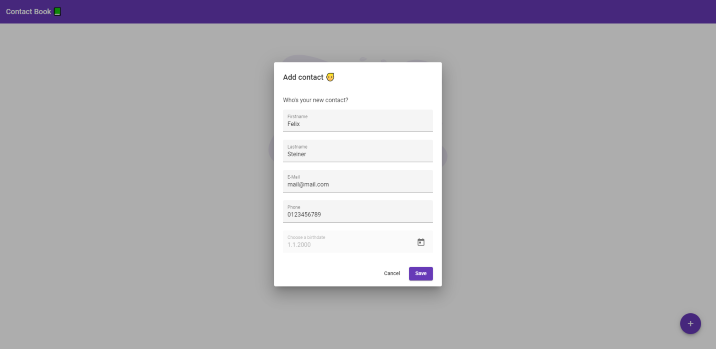

# Contact Book 📗
This project is a simple Full Stack app for managing your contacts. It contains an API developed with Node.js and PostgreSQL and a frontend developed in Angular using Material UI which is deployed using Nginx. The whole app can be deployed using Docker (especially Docker compose). 

## Goal of the project
The main goal of this project is to show how: 
- Docker compose works
- Node.js and PostgreSQL can be used to store and retrieve data
- Angular can be used along with the Material UI Kit 
- an Angular app can be deployed using Nginx

## Getting Started 🚀
### Prerequisites
- Git installed
- Docker installed
- Docker compose installed

Moreover, I recommend using Linux Ubuntu 20.04, since that was my setup when developing this project. However, this project should work platform-independent, assuming a proper configuration.

### Steps
1. Open a terminal and clone the repository
2. Switch into the _contact-book_ directory
3. Run `docker-compose up` in your terminal
4. The contact book app should now be up and running 😄

How to access the app:
- Frontend: `localhost:80`
- Backend: `localhost:8080`

## API endpoints ⚙
- `GET /contacts`: lists all contacts
- `GET /contacts/:id`: lists a specific contact
- `POST /contacts`: creates a new contact
  - Payload: { firstname: _firstname_, lastname: _lastname_, email: _email_, phone: _phone_, birthdate: _birthdate_ }
- `PUT /contacts/:id`: updates a specific contact
  - Payload: same as for `POST`
- `DELETE /contacts/:id`: deletes a specific contact

## Preview 👀
Empty Contact Book

Add new contact

View all contacts

